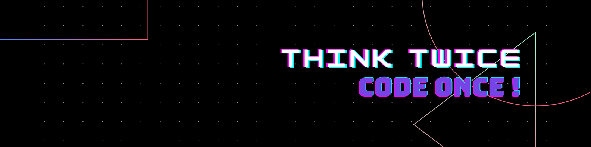

  

<h1 align="center">Hi 👋, I'm Pritam Singh</h1>
<h2 align="center">Freshman at JUET, Guna</h2>

## 🌐 Socials:
   

# 💻 Tech Stack:
         
# 📊 GitHub Stats:
 
 

## 🏆 GitHub Trophies

### ✍️ Random Dev Quote

---

<!-- Proudly created with GPRM ( https://gprm.itsvg.in ) -->